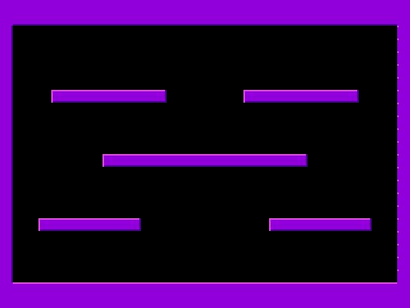

# Bubble Bobble prototype - SAM Coupe

A tile-mapped platform background, bubbles that ride a wind current around
the level, and a renderer built around the SAM's memory contention rather
than around its clock speed.

Design, frame budget and the derivation of every number:
**[../docs/BUBBLE_BOBBLE_SAM.md](../docs/BUBBLE_BOBBLE_SAM.md)**

    ./build.sh           generate assets, assemble, verify

## The short version

The SAM's ASIC grants the CPU one memory access per 8 T while the raster
is in the display window, so a frame is **23,808 memory accesses**, not
119,808 T-states. `PUSH` writes 2 bytes per 3 accesses - the floor on this
machine - which caps screen writes at 15,872 bytes a frame against a
24,576-byte MODE 4 screen. Full-screen redraw is arithmetically impossible,
so the renderer is double-buffered dirty rectangles with compiled sprites.

Predicted: 18 fully-redrawn 16x16 objects per 50 Hz frame. **Measured, by
running the code: about 5.** `bubble/tools/profile.py` attributes every memory
access to the nearest label and puts the tiled erase at 45% of the frame -
4.6x what the cost model assumed, because it recomputes loop invariants.
The per-instruction annotations were all correct; the model on top of them
was not. See section 4 of the design document for the profile and the
three structural fixes that close the gap.

The GIF above is not a mock-up: it is the MODE 4 framebuffer captured out
of a Z80 emulator running the assembled image, one field at a time.

## Files

| File | |
|---|---|
| `bb.z80s` | root: memory map, include order |
| `bb_equ.z80s` | hardware ports, memory map, object layout |
| `bb_vars.z80s` | RAM layout for sections A/B |
| `bb_init.z80s` | mode 4 setup, palette, runtime tables |
| `bb_main.z80s` | entry point, frame loop, interrupt handler |
| `bb_level.z80s` | 1-bit level bitmap, autotiler, tile collision |
| `bb_bg.z80s` | paint the tile map into a buffer (level load) |
| `bb_flow.z80s` | the wind current - local rules, no authored data |
| `bb_boxes.z80s` | cell-level queries about an object's box |
| `bb_blit.z80s` | stack-blit fill, tile-sourced erase, screen addressing |
| `bb_obj.z80s` | 48-slot object table, priority by slot order |
| `bb_bubble.z80s` | bubble physics: wind, buoyancy, separation |
| `bb_actors.z80s` | players, enemies, pickups, spawning, input |
| `bb_render.z80s` | plan / erase / draw, and the budget governor |
| `gen/bb_gfx.z80s` | generated: palette, tiles, levels, compiled sprites |

## Emulation

`bubble/tools/z80.py` is a Z80 core and `bubble/tools/sam.py` wraps it in enough SAM
Coupe - paging, CLUT, keyboard matrix, MODE 4 decode - to run the
assembled image. It found four real bugs that reading the source had not:

* `bb_init` reset `SP` after being CALLed, discarding its own return address
* compiled opaque sprites cache byte pairs in `IX`/`IY`, which silently
  destroyed the render pass's object pointer; that one took 31 frames to
  show, because it only bit once an opaque draw and an enemy coincided
* enemies compared position deltas to detect walls, which cannot work at
  under 1 px per frame
* the row-address table left entries 192-255 zero, so any out-of-range Y
  would have stack-blitted straight into the code at `$0000`

## Conventions

Source carries `; [11T / 3a]` - natural T-states **and** memory accesses.
`bubble/tools/budget.py` re-derives every one of them from a Z80 timing table and
fails on disagreement (1,395 annotations currently checked, 0 wrong).

The blitter parks `SP` inside the framebuffer, so the render pass runs with
interrupts disabled and any routine that moves `SP` saves and restores it
around itself.
