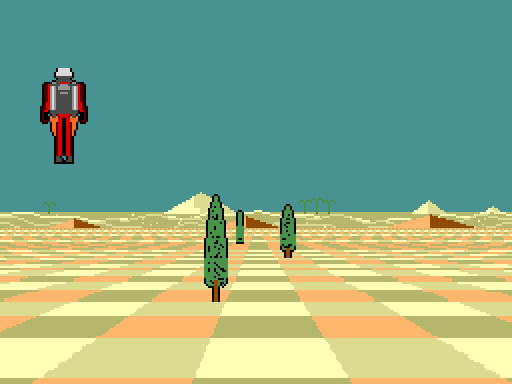

# loader.md — chequer10 as a file a SAM boots

`layout.md` used to end with "What is not here: **a loader**". This is it:
`build/chequer10.sbt`, 376,832 bytes, which SimCoupe boots straight into and
which a real SAM loads with `LOAD CODE 32768: CALL 32768`.

    python3 tests/mksbt10.py            # build it
    simcoupe build/chequer10.sbt        # or copy it to a blank disk and BOOT

Three files and a table:

| | |
|---|---|
| `tests/sam_chq10_load.asm` | the loader: it moves the map into place |
| `tests/sam_chq10_boot.asm` | six instructions in the bank's spare bytes, which hand over |
| `demo10.z80s` | the driver: palette, pacing, flip, and the flight played from a table |
| `tests/mkdemo10.py` | which writes that table, from the same path `tests/mkgif.py` records the GIF on |

## The two limits that shape the image

**A CODE file loaded at 32768 is the memory map.** The address is logical:
page 1, offset 0, and the load fills as many 16K pages as the file has. So
byte offset *n* lands at page `1 + n/16384`, and an image can simply *be*
the map with the buffers as holes in it. Two things stop that here:

- **Page 0 cannot be loaded into**, because the load starts at page 1 — and
  the map `tests/sam.py` verified puts the bank's first chunk there, with
  the stack at `0x7FFE`.
- **A `.sbt` stops at the end of side 0.** SimCoupe presents the file as a
  chain of sectors; the chain crosses to side 1 and the reader treats side
  1's first four tracks as directory tracks, so they come back empty and
  the load ends with *"108 End of file"*. The limit is
  76 × 10 × 510 = **387,600 bytes**, measured by bisection, and 64K of
  holes over the buffers does not fit inside it. It looks like a one-line
  bug rather than a design limit: `designs/simcoupe-sbt-side0.md` is the
  report, with the code path and a suggested fix.

So the image ships the chunks **back to back** — 23 pages, 10,768 bytes
under the limit — and the loader puts them where they belong.

## How the loader gets out of its own way

Moving a page needs three things mapped at once: the page, where it is
going, and the code doing the moving. The Z80 has two blocks. So:

1. The entry stub pages its own page in at `0x0000` as well, and jumps
   there — the high block is about to stop being this code.
2. It copies its whole page into **page 26**, which nothing in the map
   wants, and jumps into the copy. Now the loader is in the high block and
   the *whole* low block is free to be anything at all.
3. Each page goes out through the staging half of the loader's own pair
   (`0xC000`) and back into the low block at its map page. 22 pages, about
   two seconds of `LDIR`, in an order that never overwrites a chunk before
   it has moved: the ones going up from the top down, the ones coming down
   from the bottom up. `tests/mksbt10.py` works the order out and ships it
   as a table.
4. The resident block — the demo's code, and this driver — goes behind each
   buffer, which is the 8K a MODE 4 screen leaves at the end of its odd
   page.
5. `LMPR` goes to the bank, and the loader jumps to six instructions that
   ride in the bank's own spare bytes: only code in the *low* block can set
   `HMPR` to a buffer, because doing that is what takes the loader's page
   away.

## What the driver adds

**The flight is a table.** The bench pokes the camera, the horizon, the
pilot and the three tree slots for every frame; on a machine nothing is
there to poke them, so `tests/mkdemo10.py` writes out 17 bytes a frame —
in the order the state sits in memory — and the driver plays it. 200
frames, 3,400 bytes, and it loops. Where a tree goes is a perspective
division and a size decision whose answer is the same every run, so it is
worth 17 bytes rather than a routine.

**The flip comes off the end of the frame.** `cq10_frame` ends by pointing
VMPR at what it has just drawn, which on a bench is free and on a machine
tears the picture if the raster is part way down it. So the driver patches
a `RET` over that flip — in *both* copies of the resident block, which is
one `OUT` apart — and does it itself after the flyback.

**The flyback is polled, not taken**, and that took finding. The frame
interrupt is active for 128 T-states and a handler that takes it is still
inside that window when it expires, so a poll with interrupts *on* never
sees the bit low and the demo waits for ever. With `DI` round the poll it
is four instructions.

**Interrupts still have to be safe**, because the demo's own routines `EI`
after every stretch that puts `SP` on the screen, and ROM 0 is paged out —
`0x0038` is the middle of the bank. So the machine goes to **IM 2**: 257
bytes of the same byte at `0xFA00`, so that whatever the bus puts up lands
on the same handler, and a handler at `0xFBFB` that returns.

## What it runs at

| | T-states | |
|---|---|---|
| a frame, on the bench | 116,685 … 219,062 | what `costs.md` counts |
| a frame, contended | **148,856 … 318,856** | ×1.52, `tests/sam.py`'s model |
| held for | **1.2 … 2.7 display frames** | so **25 Hz down to 16.7** |
| **measured on SimCoupe** | | **49.4 ms a frame, 20.2 Hz, 2.48 display frames** |

The spread is the horizon: the board is 10% of the screen at its shortest
and 50% at its tallest, and the tall one costs twice the short one. The
camera therefore steps **2.5 display frames' worth a frame** — the mean —
so the ground goes past at the speed the GIF shows it at, with the judder
that a demo whose cost swings by a factor of two has on a real machine.

**And the machine agrees with the model.** 2.48 display frames measured
against 2.5 predicted, over a whole lap of the flight — which is the
contention model priced end to end on a demo rather than on the three
instructions `contend.z80s` times.

How that is measured matters, because the obvious way is wrong: the flight
**loops every 200 frames**, so two screenshots far enough apart to time
reliably cannot tell one lap from two, and the first attempt here read
3.9 Hz because 240 frames had gone by and 40 were counted. `simshot10.py`
instead builds two images that draw a known number of frames and then halt
— 1 and 200 — runs each under SimCoupe's `-exitonhalt` and takes the
difference, so the boot and the 377K load cancel out. `tests/sam_tick.asm`
does the same for the host, counting display frames and halting, so the
emulator's own speed is measured rather than assumed: **100% of real time**
here, which is what makes the 20.2 Hz a number about a SAM.

## What checks it

    python3 tests/test_sbt10.py                      # the image, on the bench
    SIMCOUPE=... python3 tests/simshot10.py          # and on the machine

`test_sbt10.py` runs **the shipped image** from the entry state the ROM
leaves (`LMPR = 0x1F`, `HMPR = 1`, called at `0x8000`) with nothing poked at
all, and checks the map the loader assembled chunk for chunk against
`tests/sam.py`'s, the palette it wrote, and six frames of the flight
against `tests/chequer10.py` — the same model the bench test compares
against. `simshot10.py` does the last of those on SimCoupe instead: the
real ROM, the real ASIC, a screenshot through SimCoupe's own key, matched
against every frame of the flight — and then times the demo as above. Both
come out **bit exact**.

Three build options exist for the timing and for getting at what a machine
with no debugger is doing, and `tests/mksbt10.py`'s `build(defines=...)`
takes them: `DEMO_HALT=n` stops after n frames and halts, `DEMO_NOKEYS`
does not quit on a keypress, and `DEMO_TRACE` puts a number on the border
at each stage of the start-up.

## Gotchas worth keeping

- **The first VMPR write is not a flip.** `chq4_init` points the video
  hardware at one buffer while it fills the other, which a flip counter
  will happily count as frame 0.
- **A key held at boot quits the demo.** SimCoupe's autoboot types `BOOT`,
  and the demo quits on any key; build with `-DDEMO_NOKEYS` for an
  unattended run.
- **`-DDEMO_TRACE`** puts a number on the border at each stage of the
  start-up — which is how the interrupt problem above was found, on a
  machine with no debugger attached.
- **A demo that loops cannot be timed by watching it.** See above: the
  aliasing reads low and looks exactly like a slow host.
- The image wants a **512K** SAM: the map claims 26 pages and the loader
  borrows a 27th.
