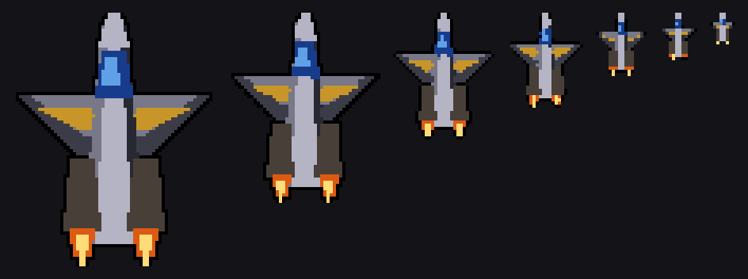

# mipsprite.md — a compiled sprite that zooms, 64x80 down to 8x10

**The answer first.** A 64x80 compiled sprite, drawn at its full size over
a static backdrop, moving, and clearing up after itself, costs **28,475
T-states — 23.7% of a 50 Hz frame.** Four of them fill 95% of it. At the
other end of the chain an 8x10 costs **1,749 T-states, 1.5%**, and 68 fit.
A mixed scene of one big, two mid, four small and eight tiny — fifteen
sprites over a 3:1 depth range — is **77,129 T-states, 64% of the frame.**

Over a backdrop that redraws itself anyway (a chequer floor, a starfield),
the top level drops to **15,486 T-states, 12.9%**, and seven and a half fit.

Everything below was measured on the emulator by `tests/test_mipsprite.py`
and checked byte for byte against the model first. What is reasoned rather
than measured says so.

---

## 1. What the format decides before anything else

MODE 4 is **two pixels a byte**. That single fact fixes the whole design:

- **Scaling down the y axis is free.** A row of the sprite either appears
  or it does not; no pixel is ever combined with another.
- **Scaling down the x axis is not.** Two neighbouring output pixels share
  a byte, so any x scale that is not a whole number of bytes has to
  *repack nibbles* — and `roto` measures an arbitrary computed byte at
  **109.7 T-states**, twenty times a `PUSH`.

So the renderer must never resample horizontally at run time. The x scales
have to exist already. That is what the chain is for, and it is why this is
not really a MIP chain: a MIP chain is a memory for a filter, and this is a
memory for a *packing*.

The chain is seven widths, each with the height that matches the master's
aspect:

| bytes | pixels | rows | box | covered | of box |
|---|---|---|---|---|---|
| 32 | 64x80 | 80 | 2,560 | 1,152 | 45% |
| 24 | 48x60 | 60 | 1,440 | 682 | 47% |
| 16 | 32x40 | 40 | 640 | 320 | 50% |
| 12 | 24x30 | 30 | 360 | 176 | 49% |
| 8 | 16x20 | 20 | 160 | 80 | 50% |
| 6 | 12x15 | 15 | 90 | 54 | 60% |
| 4 | 8x10 | 10 | 40 | 24 | 60% |

**The width is quantised to the chain; the height is not.** A row program
picks which source rows get drawn, so every height from 80 down to 10 is
available at a cost that is flat in the number of rows drawn — 283 to 297
T-states a row, whatever the height:

| height | T-states | a row | % of a 50 Hz frame |
|---|---|---|---|
| 80 | 22,599 | 282.5 | 18.8% |
| 60 | 17,010 | 283.5 | 14.2% |
| 40 | 11,375 | 284.4 | 9.5% |
| 20 | 5,811 | 290.6 | 4.8% |
| 10 | 2,968 | 296.8 | 2.5% |

So the sprite grows smoothly in y and steps in x, one level at a time. The
steps between levels are 1.33x and 1.5x, which is **an aspect error of up
to 16% at the 1.33 steps and 22% at the 1.5 ones** if the height is taken
as exact. Halving that means doubling the
number of widths, and §7 is what that costs in memory. §6 is the
other answer: six variants and no scaling at all.

## 2. The sprite is code, and the code is `PUSH`

Each row of each level compiles to a straight-line block that writes the
row right to left with `SP` walking down the screen. `tricks.md` §2 is the
reason: `PUSH` is the only way to write two bytes in 11 T-states.

A pair of bytes costs 11 if its value is already in a register and 21 if it
has to be loaded (`LD DE,nn` then `PUSH DE`), so the compiler keeps a
register cache — `BC`, `DE`, `HL` rotated by optimal (offline) replacement,
plus `IX` pinned to the level's commonest value for the whole level. The
cache is worth **15% at the top level**, falling to 7% by 24x30, because a
small level's pixels are less alike than a big one's:

| | cached | `LD`+`PUSH` every pair | saved |
|---|---|---|---|
| 64x80 | 15,486 | 18,210 | 15.0% |
| 48x60 | 10,350 | 11,668 | 11.3% |
| 32x40 | 5,751 | 6,215 | 7.5% |
| 24x30 | 3,631 | 3,895 | 6.8% |

Transparent bytes are skipped rather than masked: `DEC SP` at 6 T-states a
byte up to four, and `LD HL,-n` / `ADD HL,SP` / `LD SP,HL` at a flat 27
above that. **Nothing is ever read-modify-written**, because the silhouette
is rounded out to whole bytes and to an even number of them — a `PUSH`
writes a pair, so an odd-length run would spill a byte into the backdrop.
That is `chequer6`'s trick (give the odd pixel to the sprite's own black
outline) with one extra condition on it.

**The interrupt has to be let in.** A whole 64x80 sprite is 22,049
T-states with `DI` held throughout — 3.7 ms, which no 50 Hz frame
survives. `scroll8` measures a window at 22 T-states, and here it is free
of the save and restore, because the dispatcher already has the next `SP`
in `HL`:

    LD HL,step : ADD HL,SP : LD SP,IY : EI : NOP : DI : LD SP,HL

| | every row | every fourth row | none |
|---|---|---|---|
| 64x80 | 23,787 | **22,489** | 22,049 |
| 32x40 | 7,289 | **6,651** | 6,431 |

Every fourth row costs **2.0%** and holds the interrupt off for 187 µs;
every row costs 7.9% for 50 µs. Every fourth row is the setting used in all
the headline figures. The `NOP` is not padding — see `tricks.md` §2.

## 3. Two shapes, and which one to use

**`dispatch`** compiles one block a source row and reaches them through a
row program — a list of block addresses, walked in the shadow register set
so the fill keeps all of `BC`, `DE`, `HL` and `IX`:

    disp: LD HL,step / ADD HL,SP / <window> / LD SP,HL
          LD A,(DE) / INC E / LD L,A / LD A,(DE) / INC E / LD H,A / JP (HL)

**`whole`** compiles every row of one height into a single straight-line
block. No dispatch, no `EXX`, the register cache carries across rows, and
the row's left margin folds into the row step because both are just
additions to `SP`.

| | dispatch | whole | |
|---|---|---|---|
| 64x80 silhouette | 22,599 | **15,486** | 89 T-states a row |
| 32x40 silhouette | 9,112 | **5,751** | 84 |
| 8x10 silhouette | 1,559 | **821** | 74 |

**Whole is 31% cheaper and needs a block per height.** Dispatch is 89
T-states a row dearer and needs one set of blocks for all 71 heights. The
89 is 52 of dispatch proper (`EXX` twice, the `JP`, and 34 to fetch the
next address), 27 of left margin that whole folds away, and about 10 of
cache that whole carries across the row boundary.

The rule that falls out: **whole where the sizes are few and fixed,
dispatch where the zoom has to be continuous.** A demo that flies a ship
towards the camera wants dispatch at the top of the chain, where a row is
283 T-states and the dispatch is 31% of it, and whole at the bottom, where
the dispatch is 90% of a row and the code for every height it can take is
under a kilobyte.

## 4. The erase is the other half of the cost, and there are three answers

| | T-states, top level | |
|---|---|---|
| **the backdrop redraws itself** | 0 | draw the silhouette: **15,486** |
| **draw the box opaque** | 0 for where it was | 22,489, plus the L it left |
| **silhouette, then put the box back** | 18,045 | 33,531 all told |

Filling the box back costs 5.5 T-states a byte plus 49 a row — the measured
line through every level is `5.5·wb·h + 49·h + 50`, within 5 T-states at
every size — which on 2,560 bytes is **18,045, more than the drawing**.
Drawing the box opaque instead, with the backdrop baked into the
transparent bytes, costs 7,000 more to draw and saves all of it.

What opaque still owes is the L the box leaves behind when the sprite
moves. Measured at 4 bytes across and 8 rows down between one buffer and
the next:

| | draw | the L | both | % of a 50 Hz frame |
|---|---|---|---|---|
| 64x80 | 22,489 | 5,986 | **28,475** | 23.7% |
| 48x60 | 13,639 | 4,544 | 18,183 | 15.2% |
| 32x40 | 6,651 | 3,102 | 9,753 | 8.1% |
| 24x30 | 4,139 | 2,392 | 6,531 | 5.4% |
| 16x20 | 2,129 | 1,660 | 3,789 | 3.2% |
| 12x15 | 1,373 | 1,305 | 2,678 | 2.2% |
| 8x10 | 799 | 950 | **1,749** | 1.5% |

The L is expensive out of proportion to its area — 5,986 T-states for 544
bytes — because a four-byte-wide strip 80 rows tall pays the row step 80
times for two `PUSH`es. **Below 16x20 the clear costs more than the
drawing.** For the small end of the chain the cheaper answer is to grow the
opaque box by the motion and draw it once.

## 5. How many fit in a frame

At 120,000 T-states between 50 Hz interrupts, opaque, moving, clearing up
after itself, a window every fourth row:

| all at | each | % of the frame | how many fit |
|---|---|---|---|
| **64x80** | 28,475 | **23.7%** | **4.2** |
| 48x60 | 18,183 | 15.2% | 6.6 |
| 32x40 | 9,753 | 8.1% | 12.3 |
| 24x30 | 6,531 | 5.4% | 18.4 |
| 16x20 | 3,789 | 3.2% | 31.7 |
| 12x15 | 2,678 | 2.2% | 44.8 |
| **8x10** | 1,749 | 1.5% | **68.6** |

Four at maximum size is 94.9% of the frame and leaves nothing for anything
else; three is 71% and leaves 34,600 T-states, which is a sound track
(§1b of `costs.md` puts a whole arrangement at 212) and a backdrop that is
not a repaint.

A scene with a depth range in it, which is what a chain is for:

| | T-states | % of the frame |
|---|---|---|
| 1 x 64x80 | 28,475 | 23.7% |
| 2 x 32x40 | 19,506 | 16.3% |
| 4 x 16x20 | 15,156 | 12.6% |
| 8 x 8x10 | 13,992 | 11.7% |
| **fifteen sprites** | **77,129** | **64.3%** |

Raw T-states throughout: SAM screen contention is on top of all of it, as
everywhere else in this repo.

## 6. Six variants on a z-bucket, and nothing scaled at all

The other way round from §1: quantise the size completely. Six variants
exist, geometric over the same 8:1 range, each sprite is snapped to
whichever bucket its z falls in, and nothing is scaled per instance. That
is `demo-ideas.md` §11's "two or three sizes rather than continuously",
taken as far as it goes.

**It removes three things at once.** Every variant is one straight-line
block, so the row program and the dispatcher are gone — the 89 T-states a
row of §3, everywhere. The per-sprite height decision goes with them. And
it is *smaller*: six opaque variants are **7,867 bytes against 9,001** for
the seven-level chain in the same shape, because six boxes are fewer than
seven and there is no program.

| z | size | box | T-states | a byte | % of a 50 Hz frame | code |
|---|---|---|---|---|---|---|
| 0 | 64x80 | 2,560 | 22,489 | 8.8 | 18.7% | 3,384 |
| 1 | 44x55 | 1,210 | 11,837 | 9.8 | 9.9% | 1,904 |
| 2 | 28x35 | 490 | 5,341 | 10.9 | 4.5% | 890 |
| 3 | 20x25 | 250 | 2,979 | 11.9 | 2.5% | 501 |
| 4 | 12x15 | 90 | 1,373 | 15.3 | 1.1% | 247 |
| 5 | 8x10 | 40 | 799 | 20.0 | 0.7% | 151 |

With the L a moving sprite leaves — motion scaled with the bucket, four
bytes and eight rows a frame at the top — that is the steady state:

| z | size | draw | the L | a frame | % | how many fit |
|---|---|---|---|---|---|---|
| 0 | 64x80 | 22,489 | 5,986 | **28,475** | 23.7% | 4.2 |
| 1 | 44x55 | 11,837 | 4,003 | 15,840 | 13.2% | 7.6 |
| 2 | 28x35 | 5,341 | 2,056 | 7,397 | 6.2% | 16.2 |
| 3 | 20x25 | 2,979 | 1,402 | 4,381 | 3.7% | 27.4 |
| 4 | 12x15 | 1,373 | 934 | 2,307 | 1.9% | 52.0 |
| 5 | 8x10 | 799 | 629 | **1,428** | 1.2% | 84.0 |

Fifteen of them spread 1/1/2/3/4/4 over the six buckets is **87,192
T-states, 73% of the frame**.

### What a sprite costs before it draws anything

Four steps, none of them the drawing:

1. **z to bucket.** A 256-byte table indexed by the high byte of z is
   three instructions. But a sprite sitting on a boundary would change
   size every frame, so the bucket needs **hysteresis**: keep it per
   sprite, and compare z against two boundaries — the one that grows and
   the one that shrinks, a few percent apart in z. *~40 T-states,
   reasoned.*
2. **Anchor.** The box is centred on the sprite's point, so its top left
   is the point less a half width in bytes and a half height in rows, both
   per-bucket constants. Nothing else keeps the sprite still when the
   bucket changes.
3. **Screen address.** A MODE 4 line is 128 bytes, so `row*128 + col` is a
   rotate and not a multiply. *~40 T-states, reasoned.*
4. **Dispatch.** A six-entry jump table, or a self-modified `JP`. *~30
   T-states, reasoned.*

About 110 T-states of bookkeeping, which is 0.5% of bucket 0 and **14% of
bucket 5**. At the small end the sprite costs less than deciding what it is.

### The boundary is not free in either direction

**Growing costs nothing.** The bigger box lands on top of the smaller one
and swallows it.

**Shrinking leaves a ring** — the old box minus the new one — and with two
buffers it has to be cleared in both, so it is paid on the crossing frame
*and the one after it*:

| boundary | ring | clearing it | ring + draw | of steady |
|---|---|---|---|---|
| 64x80 → 44x55 | 1,350 bytes | 12,691 | 24,528 | 1.5x |
| 44x55 → 28x35 | 720 | 7,186 | 12,527 | 1.7x |
| 28x35 → 20x25 | 240 | 3,516 | 6,495 | 1.5x |
| 20x25 → 12x15 | 160 | 2,448 | 3,821 | 1.7x |
| 12x15 → 8x10 | 50 | 1,504 | 2,303 | 1.6x |

**A crossing frame costs about 1.6x a steady one**, in both buffers, and
four thin rectangles is why: 12,691 T-states to put back 1,350 bytes is
9.4 a byte, because a five-byte-wide column 55 rows tall pays the row step
55 times for two `PUSH`es.

**The cheaper crossing is a padded form**: compile the smaller picture
*inside the box it is leaving*, and draw that for the two frames. There is
then no ring at all, because the box never shrinks until both buffers have
been through it:

| boundary | ring + draw | padded | saved | the extra form |
|---|---|---|---|---|
| 64x80 → 44x55 | 24,528 | 22,657 | 1,871 | 3,373 bytes |
| 44x55 → 28x35 | 12,527 | 11,391 | 1,136 | 1,735 |
| 28x35 → 20x25 | 6,495 | 5,115 | 1,380 | 806 |
| 20x25 → 12x15 | 3,821 | 2,887 | 934 | 467 |
| 12x15 → 8x10 | 2,303 | 1,303 | **1,000** | **222** |

At the top of the chain 1,871 T-states for 3,373 bytes is not a trade
worth making; at the bottom, 1,000 for 222 is, and the bottom is where the
sprites are many. **Pad the last two or three boundaries and clear the ring
at the first two** — 1,495 bytes for most of the saving.

### What it costs to look at

Six variants over 8:1 is **a step of 1.5x** — the sprite's width jumps by
half again at every boundary, 20 pixels at once at the top. There is no
hiding that on a sprite crossing the middle of the screen; `chequer6`'s
pilot would look like it had been swapped for a different pilot.

Three things make it liveable, in order of how much they cost:

- **Put the buckets where the eye is not.** A step is relative, so
  geometric spacing is right for perception, but the *absolute* jump is
  what a viewer catches: 1.5x of 64 pixels is 20 and 1.5x of 8 is 4. Buy
  the near end more buckets at the far end's expense — 32, 26, 20, 14, 8,
  4 bytes is 1.23x at the top and 2x at the bottom, and the bottom happens
  where the sprite is 8 pixels wide and moving fastest in z.
- **Cross where the sprite is busy.** The crossing is invisible if it
  happens while the sprite is turning, firing or behind something, and
  the bucket boundaries are yours to place in z.
- **Keep the row program for bucket 0 alone.** Measured on the same
  opaque box: `dispatch` is **29,187 T-states and 3,798 bytes** (3,636 of
  code and 162 of program) against `whole`'s **22,489 and 3,384**. So
  smooth height on the nearest sprite costs **6,698 T-states — 5.6% of the
  frame — and 414 bytes**, and buys all 71 heights where whole buys one.
  The nearest sprite then grows smoothly and everything behind it pops.
  That is the hybrid worth building: one sprite is what the eye tracks,
  and the other fourteen are not. (The window is every row in the dispatch
  figure and every fourth in the whole one — §2 — because a shared
  dispatcher has nowhere to put the choice.)

## 7. Memory, which is the real limit

| | bytes |
|---|---|
| the chain compiled, dispatch, silhouette | **7,550** |
| the chain compiled, dispatch, opaque box | 8,731 |
| the chain compiled whole, one height a level | 7,083 |
| a row program a level, at full height | 524 |
| the master and the levels as bitmaps | 5,290 |

**7,550 bytes is one pose, one x phase, one way round**, and it is almost
exactly the 7,680 bytes `prism` found above the two screen buffers. Which
means a 64K map holds exactly one of these and nothing else, and everything
past that is a paging problem:

- **an odd-pixel x phase** doubles it. Without one the sprite's x position
  quantises to two pixels, which at the top of the chain is 3% of its
  width and at the bottom is a quarter of it. The bottom of the chain is
  cheap to give a second phase (under 500 bytes for the last three levels);
  the top is not.
- **a mirrored copy** doubles it again, unless the artwork is symmetric.
- **a pose** — a frame of animation, or a rotation — multiplies it.
- **halving the aspect error** (fourteen widths instead of seven) takes the
  chain to about 20K. *Reasoned from the measured sizes, not measured.*

The bitmaps are 5,290 bytes and the code is 7,550, so a level is about 1.4
bytes of code a byte of picture. Compiling at init rather than shipping the
code would save nothing in the end (the bitmaps have to be somewhere), but
it does mean the 5,290 can be thrown away afterwards and the generator can
be `chequer`'s: 1.5 million T-states once, for something that is then free
every frame.

## 8. Where the pictures come from

`tests/mipsprite.py` builds the master, downscales it, packs it and rounds
the silhouette; `tests/test_mipsprite.py` turns the result into Z80 machine
code and runs it. There is no `.z80s` file and no assembler, because **a
compiled sprite is generated code, so the generator is the source** — the
same arrangement as `mkchq3data.py` and chequer3's run bank.

The downscale is a box filter *in palette space*: an output pixel is the
commonest index under it, and transparent when most of the box is. Averaging
MODE 4 indices would be meaningless — index 7 is not halfway between 6 and
8 — and this is `tricks.md`'s rule about generators that need a search
going in Python.

    python3 tests/mipsprite.py mipsprite.png    # look at the chain, 4x
    python3 tests/mipsprite.py --buckets o.png  # and the six of section 6
    python3 tests/test_mipsprite.py             # verify and time the chain
    python3 tests/test_zbucket.py               # and the six variants

The ship is 64x80 of hull, canopy and two engines, and it is drawn out of
profiles for the same reason `tests/jetpack.py` draws the pilot that way:
flat regions are not decoration here, they are what the register cache
(§2) has to hit, and a picture assembled from spans has them where a
scribble does not.

## 9. What this does not do

- **It cannot clip.** A compiled sprite writes fixed offsets from `SP`; a
  sprite half off the left edge would wrap into the row above. The cheap
  answer is to keep whole sprites on screen and give the top and bottom
  edges to the row program (which already draws a subset of rows, so a
  vertical clip is free). A horizontal clip needs compiled variants, and
  the memory says no more than one or two columns' worth.
- **It cannot recolour.** Every value is an immediate in the code. A
  palette flip is free on a SAM and costs nothing here, but a per-sprite
  tint is a second chain.
- **The x position quantises to two pixels** without a second phase (§7).
- **The aspect is quantised to the chain**, 16 to 22% at seven widths
  (§1), and the size itself is on six buckets if §6 is taken instead.
- **The interrupt latency is 187 µs** at a window every fourth row, which
  is fine for a frame interrupt and not fine for a line interrupt in the
  middle of the sprite. Every row brings it to 47 µs for 7.9%.

## 10. What was tried and dropped

| | measured | |
|---|---|---|
| **A row program instead of compiling each height whole** | +89 T-states a row: 22,599 against 15,486 at the top level | kept anyway at the top of the chain, because the alternative is a 2,675-byte block for every height the zoom passes through. Dropped at the bottom, where 74 T-states a row is 90% of the cost of the row |
| **A silhouette and a box erase, instead of an opaque box** | 33,531 against 28,475 at the top level | the erase puts back 2,560 bytes to save drawing 1,408 of them. Only worth it when the backdrop is redrawing itself anyway, and then the erase is not there at all |
| **No register cache — `LD DE,nn` / `PUSH DE` a pair** | 18,210 against 15,486 | 15% at the top level, and the cache costs nothing at run time. Below 24x30 it is worth under 7%, because a downscaled picture has fewer neighbours that match |
| **Holding `DI` across the whole sprite** | 22,049 against 22,489 | 2.0% to let the interrupt in every fourth row, against 3.7 ms of latency. Not a trade |
| **Copying a pre-scaled bitmap** | unrolled `LDI` is 16.16 T-states a byte in `scroll8` and `LDIR` 21, so 41,370 or 53,760 for 2,560 | against 8.8 a byte compiled (22,489 for the opaque box). The bitmaps also cost the same memory as the code, so it loses twice |
| **Resampling x at run time** | 109.7 T-states an arbitrary computed byte (`roto`) | 280,000 T-states for one 64x80 sprite. This is the whole reason the chain exists |
